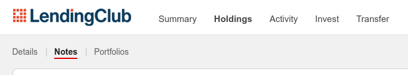

# LCview: An offline viewer for Lending Club notes statistics

LendingClub provides some features to display notes statistics on its
website, but the filter and display capabilities are quite limited.

This project aims at providing a richer set of statistics.

## Installation

To use `lcview`, you need to build it from the source
code. Pre-compiled binaries are not provided at this time.

### Dependencies

You need to install a compiler that supports `c++17`. Development was
performed against `gcc-8.2.0`.

You need the development version of the QT libraries. If you are not
using a monolithic package, you should install at least these
components: `qt-charts`, `qt-core`, `qt-gui`and
`qt-widgets`. Development was performed against QT version `5.11.x`.

*The exact commands to be used depend on your Linux
distribution. Please refer to the documentation of your distribution
for more information.*


### Build

```
git clone https://github.com/dark/lcview.git
cd lcview
mkdir build  # all generated files will be in this directory
cd build
qmake ..
make
```

Run `./lcview` to start the application.

## Usage



